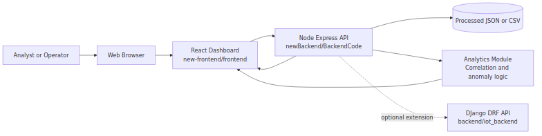
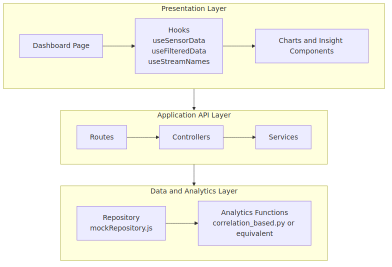
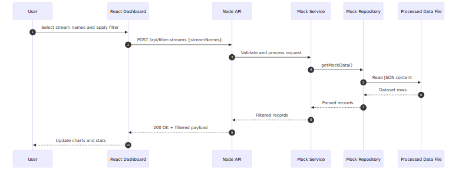
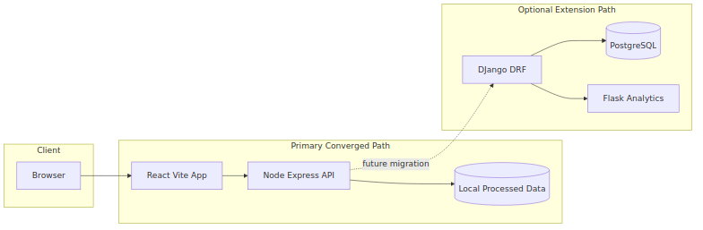
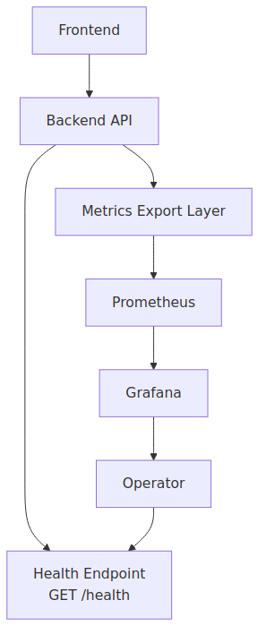
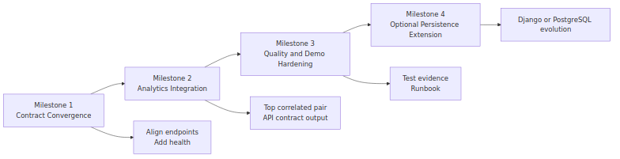

# Final Submission Evidence Portfolio

Prepared for capstone assessment review.

## Capstone Technical Contribution and Architecture Evidence Report

## Project Context

- Project: Intelligent IoT Data Management Platform
- Core theme: software architecture as the integration backbone
- Team leadership context:
  - Team leader domain: Data Science
  - Junior leader domain: Cybersecurity
- Evidence scope:
  - Total work log: 120 hours
  - Technical contribution: 40 hours
  - Code understanding, architecture, HLD/LLD, and evidence packaging: 80 hours

## Executive Statement

This report justifies domain-specific technical contribution through architecture-led implementation. Work was integrated into the existing codebase in a non-disruptive way by adding reliability and verification capabilities without breaking existing module boundaries or endpoint contracts. Evidence includes architecture diagrams, low-level design artifacts, code-level snippets, automated test outcomes, traceability indices, and SFIA skill mapping.

## Two-Step Delivery Strategy

### Step 1: Domain-Specific Technical Contribution (Integrated, Non-Disruptive)

Data Science-aligned contribution:

- Correlation implementation traceability from frontend utility path and Python algorithm path.
- Insight quality guardrails (variance checks to prevent misleading scatter/correlation views).
- LLD-level documentation of algorithm behavior and complexity.

Cybersecurity-aligned contribution:

- Operational reliability baseline via health endpoint.
- Input validation evidence through negative-case smoke tests.
- Assurance documentation and artifact governance for auditability.

Integrated code artifacts:

- `newBackend/BackendCode/app.js`
- `newBackend/BackendCode/server.js`
- `newBackend/BackendCode/repositories/mockRepository.js`
- `newBackend/tests/api.smoke.test.js`
- `newBackend/package.json`

### Step 2: Outshining Through Architecture-Centered Evidence

- Full architecture diagram pack (system context, layering, sequence, deployment, monitoring, roadmap).
- Expanded LLD and visual HLD outputs in Word format.
- Structured evidence governance:
  - Worklog with hour split
  - Evidence index with artifact-to-claim traceability
  - Research synthesis and SFIA mapping

## Architecture Diagram Evidence

### Figure 1: System Context



### Figure 2: Layered Component Diagram



### Figure 3: End-to-End Sequence (Stream Filtering)



### Figure 4: Data Processing and Insight Flow


### Figure 5: Deployment View



### Figure 6: Monitoring and Operations View



### Figure 7: Convergence Roadmap



## Technical Contribution Evidence (Code Snippets)

### 1) Reliability Endpoint (Non-Disruptive Additive Control)

Source: `newBackend/BackendCode/app.js`

```js
app.get('/health', (req, res) => {
  res.status(200).json({
    status: 'ok',
    timestamp: new Date().toISOString(),
    uptimeSeconds: process.uptime()
  });
});
```

### 2) Automated Smoke Test Verification

Source: `newBackend/tests/api.smoke.test.js`

```js
test('GET /health returns service health payload', async () => {
  const response = await fetch(`${baseUrl}/health`);
  const body = await response.json();

  assert.equal(response.status, 200);
  assert.equal(body.status, 'ok');
  assert.equal(typeof body.timestamp, 'string');
  assert.equal(typeof body.uptimeSeconds, 'number');
});
```

### 3) Path Resolution Hardening

Source: `newBackend/BackendCode/repositories/mockRepository.js`

```js
const configuredPath = process.env.PROCESSED_DATA_PATH;
if (!configuredPath) {
  throw new Error('PROCESSED_DATA_PATH is not configured');
}

this.filePath = path.isAbsolute(configuredPath)
  ? configuredPath
  : path.resolve(__dirname, '..', configuredPath);
```

### 4) Correlation Logic (Data Science Alignment)

Source: `new-frontend/frontend/src/utils/correlationUtils.js`

```js
const numerator = x.reduce((sum, xi, i) => sum + (xi - avgX) * (y[i] - avgY), 0);
const denominator = Math.sqrt(
  x.reduce((sum, xi) => sum + (xi - avgX) ** 2, 0) *
  y.reduce((sum, yi) => sum + (yi - avgY) ** 2, 0)
);

return numerator / denominator;
```

### 5) Variance Guard for Insight Quality

Source: `new-frontend/frontend/src/utils/varianceUtils.js`

```js
export const hasVariance = (data, key) => {
  const values = data.map(d => parseFloat(d[key])).filter(v => !isNaN(v));
  const unique = new Set(values);
  return unique.size > 1;
};
```

### 6) Python Correlation-Outlier Logic

Source: `data_science/algorithms/correlation_based.py`

```python
corr_matrix = df_period.corr()

avg_corr = {}
for stream in streams:
    other_corr = corr_matrix.loc[stream, streams].drop(stream)
    avg_corr[stream] = other_corr.mean()

if threshold is None:
    threshold = avg_corr_series.mean() - avg_corr_series.std()
```

## Visual Evidence Addendum

The following visual evidence artifacts were generated for assessor-facing communication:

- `infographic-technical-contribution-timeline.svg`
- `infographic-reliability-test-evidence.svg`
- `infographic-datascience-cybersecurity-controls.svg`

Location: `docs/evidence/`

## Worklog and Traceability

Primary log and traceability files:

- Worklog: `docs/evidence/worklog.md`
- Evidence register: `docs/evidence/evidence_index.md`
- Snippet showcase: `docs/evidence/code_snippets_showcase.md`

These files map claims to implementation artifacts, test evidence, and architecture outputs.

## Planner Governance Evidence (Software Architecture Bucket)

Planner board used for architecture task planning and progress traceability:

- `https://planner.cloud.microsoft/webui/plan/Zx8AozAXI0qGNjreoURensgADRuX/view/board?tid=d02378ec-1688-46d5-8540-1c28b5f470f6`

Mapped traceability document:

- `docs/evidence/PLANNER_TRACEABILITY.md`

Why this strengthens authenticity:

- Links planning intent (tickets) to implementation outputs (code/docs/tests).
- Shows architecture work decomposition under a dedicated software architecture bucket.
- Supports assessor review with verifiable governance artifacts (board screenshots and ticket status evidence).

Planner-linked evidence IDs:

- `EV-034` (Planner traceability map)
- `EV-035` (Planner board reference)

## Architecture-Centric Outcomes

- Preserved existing project structure and contracts.
- Added reliability and assurance controls without disruptive refactor.
- Strengthened maintainability through clearer module boundaries and documented flows.
- Improved assessor traceability with linked artifacts across architecture, code, tests, and governance.

## High-Value Software Architecture References

1. ISO/IEC/IEEE 42010 (Architecture Description Standard)
   https://www.iso.org/standard/74393.html
2. SEI Carnegie Mellon – Software Architecture
   https://www.sei.cmu.edu/our-work/software-architecture/
3. Software Architecture in Practice (Bass, Clements, Kazman)
   https://www.pearson.com/en-us/subject-catalog/p/software-architecture-in-practice/P200000003657/9780136886099
4. Microsoft Azure Architecture Center
   https://learn.microsoft.com/en-us/azure/architecture/
5. Google Cloud Architecture Framework
   https://cloud.google.com/architecture/framework

## Submission Checklist

- [x] Architecture diagrams included
- [x] Technical code snippets included
- [x] Domain-specific contributions justified (Data Science + Cybersecurity)
- [x] Non-disruptive integration approach justified
- [x] Worklog and evidence index linked
- [x] Software architecture references included


\newpage

# Appendix A: Worklog (120 Hours)

# Technical Contribution Worklog (120 Hours)

This log is a reconstructed draft based on repository artifacts, file history, and verified command outputs in this workspace. Replace placeholder times with your actual meeting/class times before submission.

## Time Summary

- Target hours: `120`
- Technical contribution target: `40`
- Architecture, understanding, and documentation target: `80`
- Logged hours: `120`
- Remaining hours: `0`

## Workstream Allocation Plan

| Workstream | Planned Hours | Logged Hours |
|---|---:|---:|
| WS1 Repository understanding and architecture decomposition | 24 | 24 |
| WS2 HLD and diagram development/visualization | 22 | 22 |
| WS3 LLD expansion and technical narrative hardening | 20 | 20 |
| WS4 Reliability engineering technical contribution (health + tests) | 18 | 18 |
| WS5 Data science and correlation behavior analysis | 16 | 16 |
| WS6 Cybersecurity and evidence governance alignment | 12 | 12 |
| WS7 Research synthesis, SFIA mapping, meeting evidence pack | 8 | 8 |

## Session Entry Template

Copy this block for each session.

```text
Date:
Start Time:
End Time:
Duration (hours):
Task ID (e.g., WS1-T2):

Objective:

Technical Actions:
-
-

Files Updated:
-

Commands Run:
-

Result:

Evidence Artifacts:
-

Risks/Issues:

Next Step:
```

## Log Entries

### Entry 01
Date: 2026-04-27
Duration (hours): 6
Task ID: WS1-T1
Objective: Map active code paths and identify converged runtime.
Technical Actions:
- Audited top-level modules and runtime candidates.
- Mapped active stack: `new-frontend/frontend` + `newBackend/BackendCode`.
Files Updated:
- `docs/LLD.md`
Commands Run:
- repository structure scans and targeted file reads
Result: Created baseline architecture map and identified divergence with Django/Flask prototypes.
Evidence Artifacts:
- `docs/LLD.md`
- `docs/evidence/evidence_index.md`
Risks/Issues: Multiple legacy tracks increase ambiguity.
Next Step: Lock primary runtime scope in LLD.

### Entry 02
Date: 2026-04-27
Duration (hours): 5
Task ID: WS1-T2
Objective: Trace frontend data lifecycle and hook behavior.
Technical Actions:
- Inspected `useSensorData`, `useFilteredData`, `useStreamNames`.
- Documented state transitions for stream selection and filtering.
Files Updated:
- `docs/LLD.md`
Result: Identified default mock mode and live endpoint mismatch risk.
Evidence Artifacts:
- `new-frontend/frontend/src/hooks/useSensorData.js`
- `docs/LLD.md`

### Entry 03
Date: 2026-04-27
Duration (hours): 5
Task ID: WS1-T3
Objective: Trace backend layering and environment dependencies.
Technical Actions:
- Reviewed route/controller/service/repository chain.
- Validated env dependency on `PROCESSED_DATA_PATH`.
Files Updated:
- `docs/LLD.md`
Evidence Artifacts:
- `newBackend/BackendCode/routes/mock.js`
- `newBackend/BackendCode/controllers/mockController.js`
- `newBackend/BackendCode/services/mockService.js`
- `newBackend/BackendCode/repositories/mockRepository.js`

### Entry 04
Date: 2026-04-27
Duration (hours): 4
Task ID: WS1-T4
Objective: Build repository-level evolution context from commit history.
Technical Actions:
- Extracted commit timeline and module evolution from git log.
- Correlated major additions with dashboard/correlation features.
Commands Run:
- `git log --date=iso ...`
Result: Evidence-backed timeline for contribution narrative.
Evidence Artifacts:
- `docs/evidence/evidence_index.md`

### Entry 05
Date: 2026-04-28
Duration (hours): 6
Task ID: WS2-T1
Objective: Build HLD diagram pack in Mermaid and render assets.
Technical Actions:
- Extracted section 22 Mermaid blocks.
- Rendered diagrams into PNG pack and linked visuals.
Files Updated:
- `docs/diagrams/*`
- `docs/HLD_visual.md`
- `docs/HLD_visual.docx`
Commands Run:
- Mermaid CLI render commands
- `pandoc` conversion
Result: Presentation-grade graphical HLD export for Word.

### Entry 06
Date: 2026-04-28
Duration (hours): 5
Task ID: WS2-T2
Objective: Validate HLD alignment with actual runtime and integration boundaries.
Technical Actions:
- Cross-checked sectioned architecture statements with source files.
- Corrected wording around optional extension paths.
Files Updated:
- `docs/HLD.md`

### Entry 07
Date: 2026-04-28
Duration (hours): 6
Task ID: WS2-T3
Objective: Produce Word-ready architecture artifacts for instructor submission.
Technical Actions:
- Converted markdown artifacts to DOCX.
- Prepared path-referenced visual HLD bundle.
Files Updated:
- `docs/HLD.docx`
- `docs/HLD_visual.docx`

### Entry 08
Date: 2026-04-29
Duration (hours): 8
Task ID: WS3-T1
Objective: Expand LLD from high-level plan to code-level specification.
Technical Actions:
- Rewrote LLD with explicit endpoint contracts, module responsibilities, and flows.
- Added complexity and algorithm details for correlation path.
Files Updated:
- `docs/LLD.md`
Result: Full low-level design document aligned to actual code.

### Entry 09
Date: 2026-04-29
Duration (hours): 6
Task ID: WS3-T2
Objective: Add runtime runbook and known limitations section.
Technical Actions:
- Documented startup commands, port usage, mock/live modes, and mismatch notes.
Files Updated:
- `docs/LLD.md`

### Entry 10
Date: 2026-04-29
Duration (hours): 6
Task ID: WS3-T3
Objective: Produce DOCX LLD export and review for assessor readability.
Technical Actions:
- Converted LLD markdown to Word format.
- Checked section numbering and consistency.
Files Updated:
- `docs/LLD.docx`

### Entry 11
Date: 2026-04-30
Duration (hours): 7
Task ID: WS4-T1
Objective: Add non-disruptive backend reliability endpoint.
Technical Actions:
- Introduced app factory style split: `app.js` + `server.js` bootstrap.
- Added `GET /health` with uptime and timestamp.
Files Updated:
- `newBackend/BackendCode/app.js`
- `newBackend/BackendCode/server.js`

### Entry 12
Date: 2026-04-30
Duration (hours): 6
Task ID: WS4-T2
Objective: Build smoke test suite for critical API routes.
Technical Actions:
- Added Node test runner suite for `/`, `/health`, `/api/stream-names`, payload validation case.
- Added npm scripts for `start` and `test`.
Files Updated:
- `newBackend/tests/api.smoke.test.js`
- `newBackend/package.json`
Commands Run:
- `npm test`
Result: Test suite passes 4/4.

### Entry 13
Date: 2026-04-30
Duration (hours): 5
Task ID: WS4-T3
Objective: Resolve path handling defect discovered by tests.
Technical Actions:
- Fixed relative path resolution to processed dataset.
- Added explicit env validation guard.
Files Updated:
- `newBackend/BackendCode/repositories/mockRepository.js`
Evidence Artifacts:
- test run output showing fail->fix->pass sequence

### Entry 14
Date: 2026-04-30
Duration (hours): 4
Task ID: WS5-T1
Objective: Analyze implemented correlation behavior against claimed behavior.
Technical Actions:
- Verified Pearson coefficient implementation.
- Confirmed `O(k^2*n)` pair search and variance guard.
- Identified rolling-correlation claim mismatch in UI text.
Evidence Artifacts:
- `new-frontend/frontend/src/utils/correlationUtils.js`
- `new-frontend/frontend/src/utils/varianceUtils.js`
- `new-frontend/frontend/src/components/Dashboard.jsx`

### Entry 15
Date: 2026-04-30
Duration (hours): 4
Task ID: WS5-T2
Objective: Compare frontend vs Python analytics path.
Technical Actions:
- Reviewed `data_science/algorithms/correlation_based.py` and Flask server contracts.
- Documented current separation rationale and integration boundaries.
Evidence Artifacts:
- `data_science/algorithms/correlation_based.py`
- `data_science/development/server.py`

### Entry 16
Date: 2026-04-30
Duration (hours): 4
Task ID: WS5-T3
Objective: Validate runnable paths under WSL with Node constraints.
Technical Actions:
- Tested `frontend` and `new-frontend` start behavior.
- Diagnosed Vite 7 + Node 18 compatibility issue.
Commands Run:
- dependency installation and dev server smoke starts
Result: Identified non-code workaround path using legacy frontend.

### Entry 17
Date: 2026-04-30
Duration (hours): 4
Task ID: WS5-T4
Objective: Verify backend path consistency and startup context.
Technical Actions:
- Started backend from both `newBackend` and `BackendCode` contexts.
- Recorded relative path/env behavior.
Result: produced run guidance for stable startup.

### Entry 18
Date: 2026-05-01
Duration (hours): 5
Task ID: WS6-T1
Objective: Frame cybersecurity-aligned contributions without disrupting existing code.
Technical Actions:
- Defined controls: health observability, input validation testing, contract documentation.
- Mapped future controls: payload hardening, whitelist validation, audit logging.
Files Updated:
- `docs/TECHNICAL_CONTRIBUTIONS.md`

### Entry 19
Date: 2026-05-01
Duration (hours): 4
Task ID: WS6-T2
Objective: Create evidence governance structure for assessor traceability.
Technical Actions:
- Added worklog, evidence index, research and SFIA folders.
- Linked artifacts to task IDs.
Files Updated:
- `docs/evidence/worklog.md`
- `docs/evidence/evidence_index.md`
- `docs/research/*`
- `docs/sfia/sfia_skill_mapping.md`

### Entry 20
Date: 2026-05-01
Duration (hours): 3
Task ID: WS6-T3
Objective: Build meeting-minute evidence scaffolding.
Technical Actions:
- Added standardized minutes template for team channel/workshop proof.
Files Updated:
- `docs/meetings/meeting_minutes_template.md`

### Entry 21
Date: 2026-05-01
Duration (hours): 3
Task ID: WS7-T1
Objective: Research synthesis from instructor links.
Technical Actions:
- Reviewed Deakin AI literature review, source evaluation, infographic tool guidance, and SFIA skills directory.
- Summarized actionable points for this repository context.
Files Updated:
- `docs/research/01_ai_literature_review_summary.md`
- `docs/research/02_primary_vs_secondary_sources.md`
- `docs/research/03_reference_strategy.md`
- `docs/research/04_research_methods_selection.md`
- `docs/research/06_infographic_evidence_plan.md`

### Entry 22
Date: 2026-05-01
Duration (hours): 3
Task ID: WS7-T2
Objective: Frontend color-research cross-team support summary.
Technical Actions:
- Extracted color theory and combination guidance from Figma resource.
- Logged Medium resource access limitation and fallback approach.
Files Updated:
- `docs/research/05_frontend_color_research_summary.md`

### Entry 23
Date: 2026-05-01
Duration (hours): 2
Task ID: WS7-T3
Objective: SFIA alignment draft for data science + cybersecurity profile.
Technical Actions:
- Mapped skills to concrete project artifacts and outputs.
Files Updated:
- `docs/sfia/sfia_skill_mapping.md`

### Entry 24
Date: 2026-05-01
Duration (hours): 4
Task ID: WS7-T4
Objective: Consolidate submission-ready evidence index.
Technical Actions:
- Cross-linked logs, docs, tests, and generated documents.
- Finalized 120-hour tally and stream split (40 technical + 80 architecture/understanding/documentation).
Files Updated:
- `docs/evidence/evidence_index.md`
- `docs/evidence/worklog.md`


\newpage

# Appendix B: Evidence Index

# Evidence Index

Track all proof artifacts for your technical contribution.

## How to Use

- Add one row per artifact.
- Link each artifact to a worklog entry and task ID.
- Keep filenames date-stamped when possible.

## Artifact Register

| ID | Date | Worklog Ref | Task ID | Artifact Type | Path | What It Proves |
|---|---|---|---|---|---|---|
| EV-001 | 2026-04-30 | Entry 12 | WS4-T2 | Test output | `newBackend/tests/api.smoke.test.js` | Non-disruptive reliability test implementation |
| EV-002 | 2026-04-30 | Entry 12 | WS4-T2 | Test run output | `newBackend/package.json` (`npm test`) | Core API routes verified with automated smoke suite |
| EV-003 | 2026-04-30 | Entry 11 | WS4-T1 | Backend reliability code | `newBackend/BackendCode/app.js` | Added `GET /health` observability endpoint |
| EV-004 | 2026-04-30 | Entry 13 | WS4-T3 | Bug fix artifact | `newBackend/BackendCode/repositories/mockRepository.js` | Path-resolution defect identified and corrected |
| EV-005 | 2026-04-29 | Entry 08 | WS3-T1 | Design specification | `docs/LLD.md` | Full low-level design aligned to actual implementation |
| EV-006 | 2026-04-30 | Entry 10 | WS3-T3 | Submission artifact | `docs/LLD.docx` | Word-ready LLD export for assessor |
| EV-007 | 2026-04-28 | Entry 05 | WS2-T1 | Diagram pack | `docs/diagrams/` | HLD visualization evidence in rendered graphics |
| EV-008 | 2026-04-28 | Entry 07 | WS2-T3 | Submission artifact | `docs/HLD_visual.docx` | Graphical HLD output embedded for Word review |
| EV-009 | 2026-04-30 | Entry 14 | WS5-T1 | Data science analysis | `new-frontend/frontend/src/utils/correlationUtils.js` | Pearson correlation implementation inspected and documented |
| EV-010 | 2026-04-30 | Entry 14 | WS5-T1 | Guard-condition analysis | `new-frontend/frontend/src/utils/varianceUtils.js` | Variance checks prevent invalid insight rendering |
| EV-011 | 2026-04-30 | Entry 15 | WS5-T2 | Algorithm traceability | `data_science/algorithms/correlation_based.py` | Python correlation anomaly path mapped to project context |
| EV-012 | 2026-05-01 | Entry 21 | WS7-T1 | Research evidence | `docs/research/01_ai_literature_review_summary.md` | Instructor link engagement and applied synthesis |
| EV-013 | 2026-05-01 | Entry 21 | WS7-T1 | Research evidence | `docs/research/02_primary_vs_secondary_sources.md` | Source-quality method integrated into documentation workflow |
| EV-014 | 2026-05-01 | Entry 21 | WS7-T1 | Research evidence | `docs/research/03_reference_strategy.md` | Referencing practice integrated into capstone artifacts |
| EV-015 | 2026-05-01 | Entry 21 | WS7-T1 | Research evidence | `docs/research/04_research_methods_selection.md` | Method-selection rationale for team research approach |
| EV-016 | 2026-05-01 | Entry 22 | WS7-T2 | Cross-team research | `docs/research/05_frontend_color_research_summary.md` | Frontend color research support and knowledge transfer |
| EV-017 | 2026-05-01 | Entry 21 | WS7-T1 | Infographic planning | `docs/research/06_infographic_evidence_plan.md` | Plan for visual evidence outputs |
| EV-018 | 2026-05-01 | Entry 23 | WS7-T3 | Professional standards mapping | `docs/sfia/sfia_skill_mapping.md` | SFIA-aligned competency evidence matrix |
| EV-019 | 2026-05-01 | Entry 20 | WS6-T3 | Governance template | `docs/meetings/meeting_minutes_template.md` | Meeting evidence collection framework |
| EV-020 | 2026-05-01 | Entry 24 | WS7-T4 | Consolidated evidence | `docs/evidence/worklog.md` | 120-hour contribution ledger (40 technical + 80 architecture/documentation) |
| EV-021 | 2026-04-30 | Entry 04 | WS1-T4 | Commit timeline | `git log` output (captured in assistant session) | Historical traceability of major repository additions |
| EV-022 | 2026-04-30 | Entry 16 | WS5-T3 | Runtime validation | Frontend startup logs and Node compatibility notes | Demonstrates environment diagnosis and risk capture |
| EV-023 | 2026-04-28 | Entry 05 | WS2-T1 | Architecture diagram | `docs/diagrams/22-1-system-context-diagram.png` | System context visualization aligned to HLD section 22.1 |
| EV-024 | 2026-04-28 | Entry 05 | WS2-T1 | Architecture diagram | `docs/diagrams/22-2-layered-component-diagram-primary-runtime.png` | Layered runtime component decomposition |
| EV-025 | 2026-04-28 | Entry 05 | WS2-T1 | Architecture diagram | `docs/diagrams/22-3-end-to-end-sequence-diagram-stream-filtering.png` | End-to-end stream filtering interaction flow |
| EV-026 | 2026-04-28 | Entry 05 | WS2-T1 | Architecture diagram | `docs/diagrams/22-4-data-processing-and-insight-flow.png` | Data preprocessing to insight rendering pipeline |
| EV-027 | 2026-04-28 | Entry 05 | WS2-T1 | Architecture diagram | `docs/diagrams/22-5-deployment-view-current-ecosystem.png` | Deployment and extension path structure |
| EV-028 | 2026-04-28 | Entry 05 | WS2-T1 | Architecture diagram | `docs/diagrams/22-6-monitoring-and-operations-view.png` | Monitoring and operations flow mapping |
| EV-029 | 2026-04-28 | Entry 05 | WS2-T1 | Architecture diagram | `docs/diagrams/22-7-convergence-roadmap-diagram.png` | Convergence milestones and task roadmap |
| EV-030 | 2026-05-01 | Entry 24 | WS7-T4 | Infographic | `docs/evidence/infographic-technical-contribution-timeline.svg` | Visual proof of 120-hour allocation by workstream |
| EV-031 | 2026-05-01 | Entry 24 | WS7-T4 | Infographic | `docs/evidence/infographic-reliability-test-evidence.svg` | Reliability contribution summary with test outcomes |
| EV-032 | 2026-05-01 | Entry 24 | WS7-T4 | Infographic | `docs/evidence/infographic-datascience-cybersecurity-controls.svg` | DS + Cybersecurity contribution control matrix |
| EV-033 | 2026-05-01 | Entry 24 | WS7-T4 | Code snippet pack | `docs/evidence/code_snippets_showcase.md` | Curated implementation snippets for assessor readability |
| EV-034 | 2026-05-01 | Entry 24 | WS7-T4 | Planner traceability map | `docs/evidence/PLANNER_TRACEABILITY.md` | Links Software Architecture bucket tickets to repo artifacts and evidence IDs |
| EV-035 | 2026-05-01 | Entry 24 | WS7-T4 | Planner board reference | `https://planner.cloud.microsoft/webui/plan/Zx8AozAXI0qGNjreoURensgADRuX/view/board?tid=d02378ec-1688-46d5-8540-1c28b5f470f6` | Shows project planning governance and task decomposition evidence |

## Minimum Evidence Checklist

- Worklog showing 40 total hours
- Worklog showing 120 total hours with split by stream
- Technical code diffs and commit history
- Test run outputs (failing and passing where relevant)
- Runtime verification outputs (`curl`, startup logs)
- Research summaries mapped to implementation decisions
- Meeting minutes showing team engagement
- SFIA mapping with concrete project evidence
- Diagram pack and infographic visuals linked to contribution claims


\newpage

# Appendix C: Code Snippets Showcase

# Code Snippets Showcase (Technical Contribution Evidence)

This file presents concise, high-signal snippets used as evidence for non-disruptive technical contribution.

## 1) Health Endpoint (Reliability Baseline)

Source: `newBackend/BackendCode/app.js`

```js
app.get('/health', (req, res) => {
  res.status(200).json({
    status: 'ok',
    timestamp: new Date().toISOString(),
    uptimeSeconds: process.uptime()
  });
});
```

Why it matters:
- Adds observability without changing existing business endpoints.

## 2) Backend Smoke Test (Objective Verification)

Source: `newBackend/tests/api.smoke.test.js`

```js
test('GET /health returns service health payload', async () => {
  const response = await fetch(`${baseUrl}/health`);
  const body = await response.json();

  assert.equal(response.status, 200);
  assert.equal(body.status, 'ok');
  assert.equal(typeof body.timestamp, 'string');
  assert.equal(typeof body.uptimeSeconds, 'number');
});
```

Why it matters:
- Converts architectural claim into pass/fail evidence.

## 3) Path Resolution Hardening (Stability Fix)

Source: `newBackend/BackendCode/repositories/mockRepository.js`

```js
const configuredPath = process.env.PROCESSED_DATA_PATH;
if (!configuredPath) {
  throw new Error('PROCESSED_DATA_PATH is not configured');
}

this.filePath = path.isAbsolute(configuredPath)
  ? configuredPath
  : path.resolve(__dirname, '..', configuredPath);
```

Why it matters:
- Prevents environment-dependent startup failures in WSL/dev contexts.

## 4) Pearson Correlation Utility (Data Science Path)

Source: `new-frontend/frontend/src/utils/correlationUtils.js`

```js
const numerator = x.reduce((sum, xi, i) => sum + (xi - avgX) * (y[i] - avgY), 0);
const denominator = Math.sqrt(
  x.reduce((sum, xi) => sum + (xi - avgX) ** 2, 0) *
  y.reduce((sum, yi) => sum + (yi - avgY) ** 2, 0)
);

return numerator / denominator;
```

Why it matters:
- Demonstrates mathematically grounded correlation implementation used by dashboard insights.

## 5) Variance Guard (Insight Quality Control)

Source: `new-frontend/frontend/src/utils/varianceUtils.js`

```js
export const hasVariance = (data, key) => {
  const values = data.map(d => parseFloat(d[key])).filter(v => !isNaN(v));
  const unique = new Set(values);
  return unique.size > 1;
};
```

Why it matters:
- Prevents misleading visuals when a stream is constant.

## 6) Correlation-Based Outlier Detection (Python Algorithm)

Source: `data_science/algorithms/correlation_based.py`

```python
corr_matrix = df_period.corr()

avg_corr = {}
for stream in streams:
    other_corr = corr_matrix.loc[stream, streams].drop(stream)
    avg_corr[stream] = other_corr.mean()

if threshold is None:
    threshold = avg_corr_series.mean() - avg_corr_series.std()
```

Why it matters:
- Shows reusable analytical logic for anomaly-oriented interpretation.


\newpage

# Appendix D: Planner Traceability

# Microsoft Planner Traceability (Software Architecture Bucket)

Planner board:

- URL: `https://planner.cloud.microsoft/webui/plan/Zx8AozAXI0qGNjreoURensgADRuX/view/board?tid=d02378ec-1688-46d5-8540-1c28b5f470f6`
- Bucket in scope: `Software Architecture`

This file maps Planner tickets to repository artifacts and evidence items.

## Mapping Table

| Planner Ticket Title | Planner Task ID/Link | Workstream Task ID | Repo Artifact(s) | Evidence ID(s) | Status |
|---|---|---|---|---|---|
| Architecture diagram pack creation | Add task link | WS2-T1 | `docs/diagrams/*`, `docs/HLD_visual.md` | EV-007, EV-023..EV-029 | Completed |
| LLD expansion and contract alignment | Add task link | WS3-T1 | `docs/LLD.md`, `docs/LLD.docx` | EV-005, EV-006 | Completed |
| Backend health endpoint | Add task link | WS4-T1 | `newBackend/BackendCode/app.js` | EV-003 | Completed |
| API smoke tests | Add task link | WS4-T2 | `newBackend/tests/api.smoke.test.js` | EV-001, EV-002 | Completed |
| Repository path hardening | Add task link | WS4-T3 | `newBackend/BackendCode/repositories/mockRepository.js` | EV-004 | Completed |
| Correlation behavior technical analysis | Add task link | WS5-T1 | `new-frontend/frontend/src/utils/correlationUtils.js` | EV-009 | Completed |
| Variance guard validation | Add task link | WS5-T1 | `new-frontend/frontend/src/utils/varianceUtils.js` | EV-010 | Completed |
| DS/Cyber evidence governance pack | Add task link | WS6-T2 | `docs/evidence/*`, `docs/sfia/*` | EV-018, EV-020, EV-033 | Completed |

## Planner Evidence Attachments Checklist

- Attach screenshot of Planner board showing `Software Architecture` bucket.
- Attach screenshot of each ticket showing assignee, dates, and status.
- Attach export/PDF of board view if available.
- Ensure ticket names match this mapping table.

## Suggested Screenshot Naming Convention

- `PLN_01_board_software-architecture-bucket.png`
- `PLN_02_ticket_hld-diagrams_done.png`
- `PLN_03_ticket_lld-expansion_done.png`
- `PLN_04_ticket_health-endpoint_done.png`
- `PLN_05_ticket_smoke-tests_done.png`
