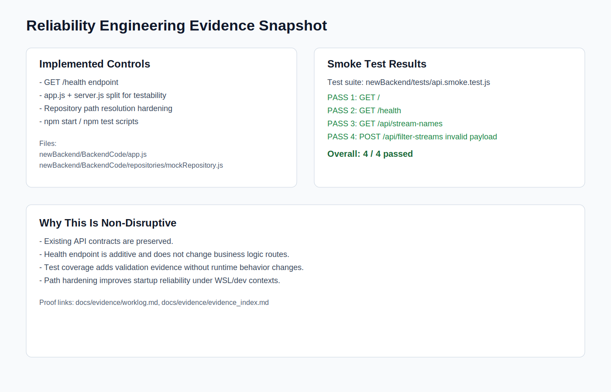

# Week 8 Progress Summary

- This week I focused on software architecture tasks and completed non-disruptive technical contributions in the active project path.
- I implemented a backend health endpoint (`GET /health`) in `newBackend/BackendCode/app.js` to improve service reliability and operational visibility.
- I created backend smoke tests in `newBackend/tests/api.smoke.test.js` to validate core routes (`/`, `/health`, `/api/stream-names`) and invalid payload handling for `/api/filter-streams`.
- I fixed backend path resolution in `newBackend/BackendCode/repositories/mockRepository.js` so dataset loading is more stable across run contexts (including WSL).
- I updated architecture documentation by expanding `docs/LLD.md` and validating HLD visuals/diagram pack in `docs/diagrams`.
- I linked technical work to evidence artifacts through `docs/evidence/worklog.md`, `docs/evidence/evidence_index.md`, and `docs/evidence/code_snippets_showcase.md`.
- I also added project governance traceability using Planner mapping in `docs/evidence/PLANNER_TRACEABILITY.md`.
- I mapped this week’s technical outputs to SFIA-aligned professional skills (Data analytics, Information security, Functional testing, Systems integration, Knowledge management) in `docs/sfia/sfia_skill_mapping.md`.
- To support engagement and demonstration, I prepared structured walkthrough scripts (Sessions 1–10) and a video evidence logging format.
- Overall, my Week 8 progress demonstrates architecture-led integration of Data Science and Cybersecurity contributions with test-backed outcomes.

## SFIA Alignment (Week 8)

- **Data analytics (DAAN):** correlation behavior analysis and data flow interpretation.
- **Information security (SCTY):** reliability and validation controls via health checks and safe request handling.
- **Functional testing (TEST):** smoke-test suite proving endpoint stability.
- **Systems integration and build (SINT):** architecture mapping across frontend, backend, and analytics paths.
- **Knowledge management (KNOW):** evidence index, planner traceability, and structured documentation.

## Reliability Evidence Infographic



## Week 8 Technical Snippets

### Backend health endpoint added

```js
app.get('/health', (req, res) => {
  res.status(200).json({
    status: 'ok',
    timestamp: new Date().toISOString(),
    uptimeSeconds: process.uptime()
  });
});
```

### Smoke test evidence for `/health`

```js
test('GET /health returns service health payload', async () => {
  const response = await fetch(`${baseUrl}/health`);
  const body = await response.json();

  assert.equal(response.status, 200);
  assert.equal(body.status, 'ok');
  assert.equal(typeof body.timestamp, 'string');
  assert.equal(typeof body.uptimeSeconds, 'number');
});
```

## Research References Used

1. ISO/IEC/IEEE 42010 (Architecture Description Standard)  
   https://www.iso.org/standard/74393.html

2. SEI Carnegie Mellon - Software Architecture  
   https://www.sei.cmu.edu/our-work/software-architecture/

3. Microsoft Azure Architecture Center  
   https://learn.microsoft.com/en-us/azure/architecture/

4. Google Cloud Architecture Framework  
   https://cloud.google.com/architecture/framework

5. Deakin AI and Literature Review Guide  
   https://deakin.libguides.com/ai-literature-review
