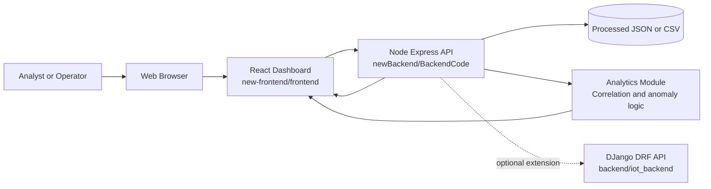
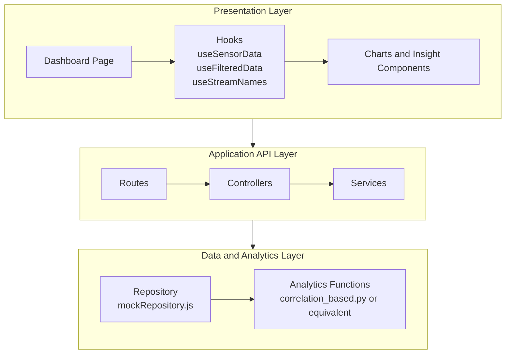
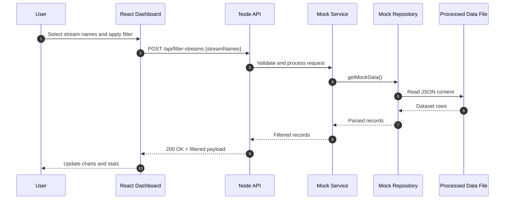
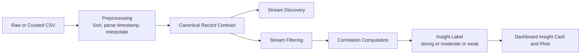
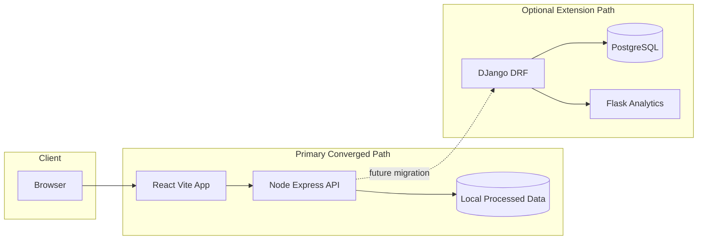
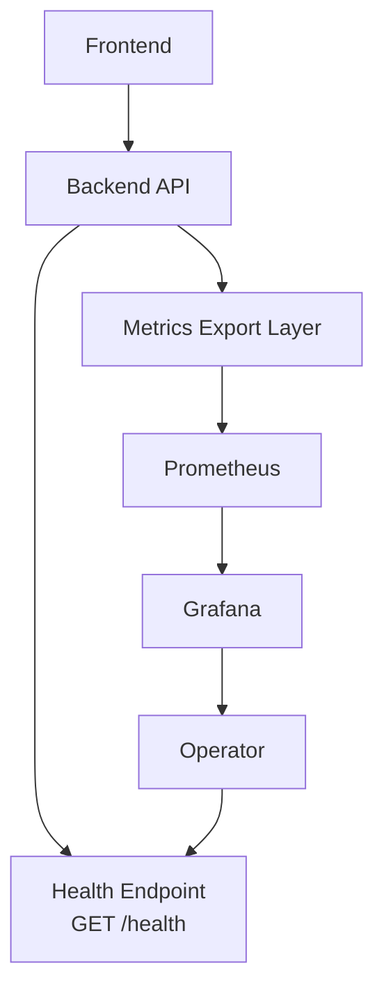
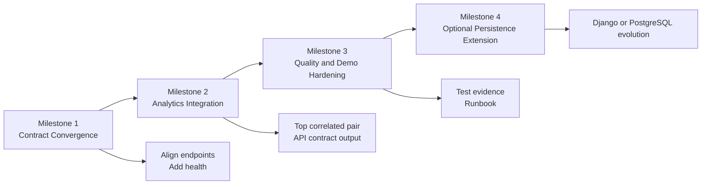

# High Level Design (HLD)

## Intelligent IoT Data Management Platform

Version: 2.2 (Pilot Convergence & Full Stack Integration)

Date: 2026-09-12

---

## Table of Contents

1. [Document Overview](#1-document-overview)
2. [System Vision and Business Context](#2-system-vision-and-business-context)
3. [Scope Definition](#3-scope-definition)
4. [Stakeholders and User Personas](#4-stakeholders-and-user-personas)
5. [Architecture Drivers](#5-architecture-drivers)
6. [Current Landscape and Repository Reality](#6-current-landscape-and-repository-reality)
7. [Target High-Level Architecture](#7-target-high-level-architecture)
8. [Component View (Layer by Layer)](#8-component-view-layer-by-layer)
9. [Data Architecture and Canonical Contracts](#9-data-architecture-and-canonical-contracts)
10. [API Architecture and Interface Contracts](#10-api-architecture-and-interface-contracts)
11. [End-to-End Functional Flows](#11-end-to-end-functional-flows)
12. [Analytics and Intelligence Design](#12-analytics-and-intelligence-design)
13. [Non-Functional Requirements (NFRs)](#13-non-functional-requirements-nfrs)
14. [Security, Privacy, and Governance](#14-security-privacy-and-governance)
15. [Deployment and Environment Architecture](#15-deployment-and-environment-architecture)
16. [Observability, Monitoring, and Operations](#16-observability-monitoring-and-operations)
17. [Testing and Quality Strategy](#17-testing-and-quality-strategy)
18. [Risk Register and Mitigation Plan](#18-risk-register-and-mitigation-plan)
19. [Migration and Convergence Plan](#19-migration-and-convergence-plan)
20. [Open Decisions and Assumptions](#20-open-decisions-and-assumptions)
21. [Appendix: Mapped Repository Artifacts](#21-appendix-mapped-repository-artifacts)
22. [Architecture Diagram Pack](#22-architecture-diagram-pack)

---

## 1. Document Overview

### 1.1 Purpose

This High-Level Design (HLD) defines a complete architectural blueprint for the Intelligent IoT Data Management Platform. It is written to serve both academic and engineering objectives: it explains system intent, architecture boundaries, runtime interactions, data contracts, quality attributes, and delivery roadmap in enough detail to support implementation, demonstration, and assessment.

### 1.2 Intended Audience

- Technical assessors evaluating architecture quality and rationale.
- Developers implementing frontend, backend, and analytics modules.
- Data science contributors operationalizing algorithmic prototypes.
- Project leads coordinating milestones, risks, and integration.

### 1.3 How to Read This HLD

- Sections 2-7 describe why the system exists and the chosen architectural direction.
- Sections 8-12 describe what the system is and how core flows execute.
- Sections 13-18 describe quality, security, operational readiness, and risk posture.
- Sections 19-21 provide practical transition and traceability to repository assets.

---

## 2. System Vision and Business Context

The platform addresses a common IoT problem: large volumes of time-series sensor data are collected, but practical decision support is weak without integrated analytics and interpretable visualization.

The system therefore provides a modular pipeline for:

1. ingesting and serving sensor streams,
2. filtering and contextualizing data by selected streams/time windows,
3. computing statistical relationships (for example, correlations and outlier signals), and
4. presenting interpretable results via an interactive dashboard.

### 2.1 Strategic Objective

Deliver a coherent, demonstration-ready intelligent IoT analytics platform that connects software engineering structure (services, APIs, UI, operations) with data science outcomes (correlation insight, anomaly discovery).

### 2.2 Problem Statement

Without architectural convergence, prototype-heavy repositories often suffer from stack fragmentation, endpoint mismatches, inconsistent data schema assumptions, and unstable demo execution. This project currently exhibits those symptoms and requires a controlled architecture convergence plan.

---

## 3. Scope Definition

### 3.1 In Scope (Target Delivery)

- A unified runtime path centered on:
  - React dashboard (`new-frontend/frontend`),
  - Node/Express API (`newBackend/BackendCode`),
  - curated analytics logic integrated behind API contracts,
  - canonical JSON/CSV sensor payloads.
- Stream discovery, stream filtering, and dashboard visual analytics.
- Correlation-based insight for selected streams and selected windows.
- Baseline operational readiness with health checks and reproducible startup.

### 3.2 Out of Scope (Current Iteration)

- Full enterprise IAM, RBAC, and SSO lifecycle.
- Multi-region or Kubernetes-grade production deployment.
- Full MLOps model lifecycle orchestration with feature stores and model registries.
- High-frequency streaming guarantees at industrial telemetry scale.

### 3.3 Success Criteria

- End-to-end UI -> API -> analytics -> visualization flow works reliably.
- One canonical data contract is consistently honored.
- Key user journeys execute without manual patching of code during demo.
- Architecture documentation and implementation are aligned.

---

## 4. Stakeholders and User Personas

### 4.1 Primary Stakeholders

- Platform developers (frontend/backend integration).
- Data science contributors (algorithm adaptation and validation).
- Assessment panel and supervisors.
- Future maintainers onboarding into the project.

### 4.2 User Personas

1. Analyst user
   - Selects streams and time ranges.
   - Interprets correlation and anomaly behavior.
   - Exports insights for reporting.

2. Technical operator
   - Starts services and verifies health.
   - Diagnoses API failures and data contract issues.
   - Maintains runbook consistency.

3. Data scientist
   - Prototypes algorithms on historical datasets.
   - Promotes reusable functions into runtime services.
   - Compares algorithm output behavior across windows.

---

## 5. Architecture Drivers

### 5.1 Functional Drivers

- Multi-stream sensor data visualization.
- Stream-wise filtering and selected-window analysis.
- Correlation insight and anomaly-oriented interpretation.
- Simple and stable interfaces between UI, API, and analytics.

### 5.2 Non-Functional Drivers

- Reliability: predictable demo startup and consistent endpoint behavior.
- Maintainability: modular code ownership and explicit layering.
- Reproducibility: clear, low-friction setup for evaluators.
- Performance: responsive dashboard and manageable processing latency.

### 5.3 Constraint Drivers

- Academic timeline and bounded implementation capacity.
- Existing repository includes multiple parallel technology paths.
- Must preserve existing data science value while reducing integration complexity.

---

## 6. Current Landscape and Repository Reality

The repository now reflects merged contributions from multiple teams. The pilot execution path has converged to a single Docker-based runtime, while earlier prototypes are retained as controlled extension paths:

Primary (pilot / demo) path:

- Frontend: `new-frontend/frontend` — React/Vite dashboard with real signup, login and MFA OTP flow, dataset cards, analysis panel, protected routes.
- Backend: `backend` — Node/Express API with PostgreSQL persistence, authentication (JWT + MFA), dataset, timeseries, telemetry and analysis endpoints.
- Analytics: `analytics_integration` — standalone Python (Flask/FastAPI-style) service exposing the analysis contract consumed by backend `/api/analyse`.
- Persistence: PostgreSQL (containerized), holding `datasets`, `timeseries`, `auth_users` and `auth_mfa_challenges` tables.
- Ingestion: live ThingSpeak feed (channel `1350261`) polled by the backend every 15 seconds into `timeseries`.

Supporting runtime services:

- Monitoring: Prometheus, Grafana, and a Docker service exporter (`monitoring/docker_exporter`).
- Mail delivery: MailHog (SMTP `1025`, web UI `8025`) for test MFA OTP email delivery.

Retained extension paths:

- Frontend prototype A: `frontend` (legacy login/analyze/theme-switch path).
- Backend prototype A: `backend/iot_backend` (Django + DRF model-backed API — future data-layer evolution).
- Analytics prototype services: Flask servers in `data_science/development`, algorithm modules in `algorithms/`, notebooks in `correlation_study/`.

### 6.1 Architectural Implication of Current State

Integration risk has been reduced substantially since v2.1: the pilot branch now runs as one containerized stack with live authentication, database persistence, live ThingSpeak ingestion and live metrics. Remaining divergence exists primarily in extension paths that are not part of the demonstration narrative.

### 6.2 Design Decision

Keep the containerized primary path (`new-frontend/frontend` -> `backend` -> PostgreSQL, ThingSpeak ingestion, analytics integration, monitoring) as the single demonstration runtime. Treat Django/DRF, legacy frontend and Flask prototypes as documented extension paths.

---

## 7. Target High-Level Architecture

### 7.1 Logical Architecture (Primary Runtime)

```text
[User Browser]
      |
      v
[React Dashboard (new-frontend/frontend, :5173)]
      |                     (proxies /api)
      v
[Node/Express API Layer (backend, :3000)]
      |
      +--> [PostgreSQL (containers | datasets, timeseries, auth_users, auth_mfa_challenges)]
      |
      +--> [ThingSpeak ingestion poller (channel 1350261, every 15s)]
      |
      +--> [Analytics Integration service (:5002) - /api/analyse delegating analysis]
      |
      v
[Monitoring: Prometheus(:9090) <-- Grafana(:3001) <-- docker-service-exporter(:9104)]
```

### 7.2 Layered Responsibility Model

1. Presentation Layer (React)
   - User interaction, login/MFA screens, selection controls, chart rendering, insight cards.

2. Application/API Layer (Node/Express)
   - Authentication & MFA (JWT, refresh cookie, OTP via SMTP/MailHog), contract enforcement, request validation, dataset/timeseries orchestration, error shaping, ThingSpeak ingestion polling.

3. Analytics Layer (Node service -> Python analytics integration service)
   - Backend `/api/analyse` orchestrates anomaly detection and correlation which execute in the analytics integration container.

4. Data Layer (PostgreSQL)
   - Current: PostgreSQL 16 in container (`datasets`, `timeseries`, `auth_users`, `auth_mfa_challenges`).
   - File-backed mock repository retained for offline/demo fallback.

### 7.3 Architectural Principles

- Single source of truth for runtime API contracts.
- Thin controller, reusable service, isolated repository pattern.
- Deterministic analytics functions with explicit inputs/outputs.
- Explicit and stable canonical sensor record contract.
- Extension-friendly design without forcing premature infrastructure complexity.

---

## 8. Component View (Layer by Layer)

## 8.1 Presentation Layer: React Dashboard

Primary codebase: `new-frontend/frontend`

Key component groups (updated with PR #71 frontend integration):

- Pages and routing
  - `src/pages/HomePage.jsx`
  - `src/pages/DashboardPage.jsx`
  - `src/pages/Login.jsx`
  - `src/pages/RegistrationPage.jsx`
  - `src/pages/ForgotPassword.jsx`
- Dashboard orchestration
  - `src/components/Dashboard.jsx`
  - `src/components/Layout.jsx` (shared shell)
  - `src/components/ProtectedRoute.jsx` (route guard)
  - `src/components/Navbar.jsx`, `src/components/Footer.jsx`
  - `src/components/DatasetCard.jsx`
- Input controls
  - stream selector, interval selector, time selectors
- Visual output
  - line charts, scatter plot, correlated pair panel, stream stats
- Data hooks
  - `useSensorData`, `useFilteredData`, `useStreamNames`, `useTimeRange`

Responsibilities:

- Collect user intent (streams, window, interval).
- Render progressively richer visualization as selection depth increases.
- Avoid direct filesystem assumptions in final architecture.
- Support authenticated UX flow before entering protected Home/Dashboard routes.

Current gap observed:

- `useSensorData` currently defaults to mock mode and requests `/api/sensor-data` in live mode, while backend exposes `/api/streams`. This is a contract mismatch risk that must be normalized.

## 8.2 API Layer: Node/Express Service

Primary codebase: `newBackend/BackendCode`

Current implementation structure:

- Server bootstrap: `src/server.js`
- App assembly and middleware: `src/app.js` (JSON body, CORS with credentials, cookie parser, metrics middleware)
- Routes: `src/routes/index.js` plus domain route modules:
  - `src/routes/auth.js` (authentication & MFA)
  - `src/routes/datasetRoutes.js`, `seriesRoutes.js`, `timestampsRoutes.js` (datasets)
  - `src/routes/telemetry.js` (timeseries/telemetry)
  - `src/routes/analyseRoutes.js` (analysis)
  - `src/routes/thingspeak.js` (ingestion/feed)
  - `src/routes/mock.js` (mock/legacy endpoints)
- Controllers: `src/controllers/` (`authController`, `datasetsController`, `seriesController`, `timestampsController`, `dataController`, `analyseController`, `thingspeakController`)
- Services: `src/services/` (`authService`, `datasetService`, `datasetImportService`, `timeseriesService`, `analyseService`, `thingspeakService`, `emailService`)
- Repositories: `src/repositories/` (`userRepository`, `authRepository`, `datasetRepository`, `timeseriesRepository`, `thingspeakRepository`)
- Middleware: `src/middleware/authMiddleware.js`, `src/middleware/roleMiddleware.js`
- Monitoring: `src/monitoring/metrics.js` (Prometheus counters/histograms via `metricsMiddleware`)

Current exposed API (through `/api` mount):

- `POST /api/auth/register`, `POST /api/auth/login`, `POST /api/auth/mfa/verify`, `POST /api/auth/mfa/resend`, `POST /api/auth/refresh`, `POST /api/auth/logout`, password reset endpoints
- `GET/POST /api/datasets`, `GET/POST /api/datasets/:name/series`, `GET /api/datasets/:name/timestamps`
- `POST /api/telemetry/*` (timeseries/telemetry ingest and query)
- `POST /api/analyse` (delegates analysis to the analytics integration service)
- ThingSpeak feed/status endpoints
- Legacy mock endpoints (`/api/streams`, `/api/stream-names`, `/api/filter-streams` etc.) retained from `src/routes/mock.js`

Service-level endpoints:

- `GET /health` (readiness)
- `GET /ready` (startup dependency readiness)
- `GET /metrics` (Prometheus metrics export)

Repository behavior:

- Reads/writes PostgreSQL persistence via repositories against `datasets`, `timeseries`, `auth_users`, `auth_mfa_challenges`.
- File-based `mockRepository` retained for mock/offline path.

Benefits of this structure:

- Good separation between transport logic, business services and data access.
- Repository abstraction enables file -> DB replacement without rewriting controller contracts.

Backend authentication (merged and live):

- Full JWT + bcrypt password hashing + MFA OTP flow implemented in `authService.js` / `authController.js`.
- Refresh token delivered as `HttpOnly` cookie (`iot_refresh`, path `/api/auth`, SameSite=Lax).
- MFA challenges persisted in `auth_mfa_challenges`; OTP delivered by SMTP (MailHog in dev).
- Route protection via `authMiddleware.js`; role enforcement via `roleMiddleware.js`. Current convergence notes:

- Primary demo role `user` is fully functional end-to-end (register -> login -> MFA OTP -> verified session -> protected routes).

## 8.3 Optional Data Service Layer: Django + DRF Path

Codebase: `backend/iot_backend`

Key artifacts:

- Models: `timeseries/models.py`
- DRF viewsets: `timeseries/views.py`
- Router endpoints through `timeseries/urls.py` and `iot_backend/urls.py`

Current endpoint family:

- `GET /api/data/` (time series model records)
- `GET /api/processed/` (processed sensor records)

Role in HLD:

- Not primary runtime for the current converged demo.
- The pilot persistence path is PostgreSQL via the Node backend repositories; this Django/DRF path is retained as a model-backed extension candidate.

### 8.4 Analytics Integration Service Layer

Primary analytics runtime: `analytics_integration/` (Python, Dockerized, port `5002`)

- Exposes the analysis execution contract consumed by backend `POST /api/analyse`.
- Returns anomaly alerts (e.g. IsolationForest pointwise anomaly) and correlation results computed over the current dataset window.
- Instrumented with Prometheus request duration and error metrics.
- Integration flow: `frontend -> backend /api/analyse -> analytics integration /analytics/analyze`.

Retained analytics extension assets:

- Flask APIs in `data_science/development/server.py` and `server_corr.py`
- Correlation outlier function in `algorithms/correlation_based.py`
- Expanded detector portfolio (threshold, LOF, IQR, COPOD, volatility/level-shift) in DS stream benchmarks

Role in target architecture:

- Keep the deterministic algorithm contracts stable behind the analytics integration service so detector swaps and algorithm updates do not change the API shape consumed by the frontend.

### 8.5 Frontend Integration Update (Merged Pilot)

The upstream full-integration frontend (auth + dataset APIs + analytics API) is now merged into the pilot branch and operates against the real backend.

Key architecture-facing updates in the current frontend (`new-frontend/frontend`):

- Route model expanded to include login/registration/forgot-password pages.
- Protected route pattern introduces for `/home` and `/dashboard/:id`.
- Shared layout introduced for consistent navbar/footer wrapping.
- Homepage redesign and dataset card presentation for dataset entry points.
- Auth services (`src/services/authClient.js`) wired to the real backend: register, login, MFA verify/resend, refresh and logout, with access token held in memory + `sessionStorage` and axios `withCredentials`.
- Dataset/analysis services call real `GET/POST /api/datasets`, series, timestamps and `/api/analyse` endpoints.
- MFA OTP flow verified end-to-end with MailHog delivery (see evidence captures).

HLD implication:

- The presentation layer now has a working authenticated session lifecycle (`login -> MFA -> access token -> refresh cookie`), closing the gap noted in v2.1 between frontend auth screens and backend auth APIs.

---

## 9. Data Architecture and Canonical Contracts

### 9.1 Canonical Record Model

```json
{
  "created_at": "2025-03-19T15:01:59.000Z",
  "entry_id": 3242057,
  "Temperature": 22.0,
  "RH Humidity": 41.0,
  "Voltage Charge": 12.5,
  "was_interpolated": false
}
```

### 9.2 Contract Rules

- Mandatory fields: `created_at`, `entry_id`.
- Dynamic sensor keys are allowed and discovered at runtime.
- Values should be numeric where meaningful; missing values use `null`.
- Optional lineage field: `was_interpolated`.

### 9.3 Data Lifecycle (Current Pilot)

1. Live ThingSpeak channel (`1350261`) is polled by `thingspeakService` every 15 seconds (`THINGSPEAK_POLL_INTERVAL_MS`).
2. Dataset row upserted under dataset name `thingspeak-live`.
3. Each feed inserted as a wide row in `timeseries` (`ON CONFLICT (dataset_id, entry_id) DO NOTHING`).
4. Datasets/timeseries served to frontend via `/api/datasets`, series and timestamps endpoints.
5. Analysis requests reference the stored dataset through `/api/analyse`.

### 9.4 Data Quality Considerations

- Timestamp consistency: enforce ISO8601 parseability.
- Numeric coercion strategy: controlled parsing before charting.
- Sparse columns: tolerate absent keys and avoid chart crashes.
- Sampling and interval alignment: configurable for rolling analytics.

---

## 10. API Architecture and Interface Contracts

### 10.1 Live Contract (Pilot Node API)

1. `GET /health`
   - Returns service health payload with status and timestamp.

2. Auth endpoints (`POST`, mounted under `/api/auth`):
   - `register` `{ email, password, confirmPassword }` -> 201
   - `login` `{ email, password }` -> `{ mfaChallengeId, expiresInSeconds, delivery }`
   - `mfa/verify` `{ mfaChallengeId, otp, rememberMe }` -> `{ accessToken, expiresInSeconds, user }` + sets `iot_refresh` cookie (path `/api/auth`)
   - `mfa/resend`, `refresh`, `logout`, `password-reset/request`, `password-reset/confirm`
   - `admin/users` (role-protected)

3. Dataset endpoints (`/api/datasets`, `/api/datasets/:name/series`, `/api/datasets/:name/timestamps`)
   - List and upload datasets; query series and timestamp ranges.

4. `POST /api/analyse`
   - Request: `{ dataset, model, correlation }`
   - Response: anomaly alerts and correlation results.

5. Telemetry endpoints (`/api/telemetry/*`)

6. ThingSpeak feed/status endpoints (`/api/thingspeak/*`)

7. Legacy mock endpoints (`GET /api/streams`, `GET /api/stream-names`, `POST /api/filter-streams`, `GET /api/data-profile`, `POST /api/top-correlated-pair`) retained for backward compatibility.

### 10.2 Response envelope

The backend returns responses structured as:

```json
{
  "data": { ... },
  "meta": { "requestId": "req_..." }
}
```

Errors use `{ "error": { "code": "...", "message": "..." }, "meta": { "requestId": "..." } }`.

### 10.3 Error Semantics

- `400` for invalid/validation payloads (e.g. malformed `OTP_INVALID`, `VALIDATION_ERROR`).
- `401` for missing/invalid credentials or expired sessions (`INVALID_CREDENTIALS`, `SESSION_EXPIRED`).
- `404` for missing datasets/resources (`DATASET_NOT_FOUND`).
- `503`/`504` for analytics service unavailability/timeouts (`ANALYTICS_UNAVAILABLE`, `ANALYTICS_TIMEOUT`).

### 10.4 API Versioning Guidance

- Keep current unversioned routes during capstone delivery.
- Introduce `/api/v1` namespace once contracts are frozen and tested.

---

## 11. End-to-End Functional Flows


### 11.1 Flow A: Registration and Login (MFA)

1. User registers via `POST /api/auth/register`; backend hashes password (bcrypt) and persists user in `auth_users`.
2. User logs in via `POST /api/auth/login`.
3. Backend creates an MFA challenge, emails the 6-digit OTP (SMTP/MailHog in dev), returns `mfaChallengeId`.
4. User enters OTP; frontend calls `POST /api/auth/mfa/verify`.
5. Backend verifies OTP hash, issues `accessToken` and sets `iot_refresh` HttpOnly cookie (path `/api/auth`).
6. Frontend stores token, navigates to `/home`; later request failures trigger `POST /api/auth/refresh`.

### 11.2 Flow B: Dashboard Initialization

1. User navigates to a protected route (guarded by `ProtectedRoute`).
2. Frontend requests dataset/series data from API.
3. API reads from PostgreSQL via repositories.
4. UI renders dataset cards and available streams.

### 11.3 Flow C: Analysis Request

1. User triggers analysis from the dashboard.
2. Frontend calls `POST /api/analyse` with dataset/model/correlation.
3. Backend loads rows and delegates to the analytics integration service.
4. Result (anomaly alerts + correlations) is returned to the frontend.
5. Frontend renders alerts and correlation views.

### 11.4 Flow D: Health and Operational Check

1. Operator invokes `/health`.
2. API returns service status and timestamp.
3. Corridor/docker health checks and monitoring (Prometheus scraping `/metrics`) mark service as healthy.

---

## 12. Analytics and Intelligence Design

### 12.1 Analytics Objective

Provide interpretable, deterministic analytics that can be explained to non-ML users while still being technically rigorous for data science evaluation. In the pilot, analysis executes in the Dockerized analytics integration service and is exposed through a stable backend contract.

### 12.2 Current Available Methods

- Anomaly detection through the analytics integration service (IsolationForest pointwise anomaly is the pilot default).
- Correlation computation between selected streams within a window.
- Expanded detector portfolio from the DS stream (threshold, LOF, IQR, COPOD, volatility/level-shift variants) under a common benchmarking workflow.
- Legacy Flask (`/analyze`, `/analyze-corr`, `/analyze-csv`) and `algorithms/correlation_based.py` retained as research assets.

### 12.3 Productionization Strategy

- Keep algorithm inputs explicit: dataset, model (detector/metric), correlation streams/window.
- Provenance: backend `/api/analyse` returns alerts with source component, score metadata and runtime_ms.
- Return compact summary results for UI consumption.
- Isolate notebook-only logic from runtime modules.
- Preserve detector interface consistency so detector swaps do not require API contract rewrites.
- Maintain benchmark artifact generation as a separate evaluation pipeline, not a runtime dependency.

### 12.4 Candidate Insight Contract

```json
{
  "alerts": [
    {
      "alert_type": "POINTWISE_ANOMALY",
      "message": "Anomaly detected in temperature using IsolationForest.",
      "method": "IsolationForest",
      "score": 0.0024,
      "target": { "entity_id": "thingspeak-live", "metrics": ["temperature"] },
      "timestamp": "2026-09-02T13:27:05Z"
    }
  ],
  "correlations": []
}
```

### 12.5 Explainability Expectations

- Every metric exposed in UI should include a plain-language interpretation label.
- Visual artifacts (scatter/trendline/rolling plots) should correspond to computable backend values.
- Threshold-based classification should be documented and reproducible.

---

## 13. Non-Functional Requirements (NFRs)

### 13.1 Reliability

- Startup reliability target: all mandatory services reachable within 2 minutes.
- Health endpoint should support automated readiness checks.
- Failures should degrade gracefully with actionable UI/API messages.

### 13.2 Performance

- Initial dashboard meaningful render: target under 3 seconds on local developer machine.
- Filter action response: target under 1 second for moderate dataset size.
- Correlation computation: target under 2 seconds for selected stream subset.
- Analytic route latency and endpoint performance are measured live on the Grafana dashboard (p95 latency, error rate, endpoint performance snapshot) to establish a benchmark baseline for bottleneck analysis.

### 13.3 Scalability

- Current design scales vertically for capstone dataset sizes.
- Repository abstraction supports future migration to DB-backed pagination and query pushdown.

### 13.4 Maintainability

- Clear layering and module ownership.
- Reusable hooks and utility segregation in frontend.
- Service/repository separation in backend.

### 13.5 Portability and Reproducibility

- Docker-based service packaging available in repository.
- Environment-variable-based file path configuration.
- Consistent setup steps should be captured in runbook.

---

## 14. Security, Privacy, and Governance

### 14.1 Authentication (live in pilot)

- Full registration/login flow implemented in the backend (`authService.js`, `authController.js`).
- Passwords hashed with bcrypt.
- Login requires MFA: a 6-digit OTP is emailed (SMTP; MailHog in development) and verified before issuing tokens.
- Short-lived access token (JWT) returned on verify; refresh token set as `HttpOnly` cookie (`iot_refresh`, `Path=/api/auth`, `SameSite=Lax`).
- Route protection via `authMiddleware.js`; role-based checks via `roleMiddleware.js`.
- MFA challenges stored in `auth_mfa_challenges` with expiry, attempts and resend window.

### 14.2 Security Convergence Note

- Frontend auth flow and backend JWT/MFA contract are connected end-to-end through a single token issuance/refresh contract (access token + `HttpOnly` refresh cookie).

### 14.3 Current Security Posture

- CORS enabled for development with credentials support.
- Authentication/authorization boundary established for protected application routes.
- Input validation on POST payloads with structured error codes.
- Environment secrets in `.env`, excluded from version control.

### 14.4 Future Security Enhancements

- Role-sensitive access for administrative operations beyond the current admin user listing.
- Audit logs for analysis requests and exports.
- Data retention and deletion policies.

### 14.5 Data Governance Notes

- Track source and processing lineage for datasets used in demos (ThingSpeak channel + entry_id identity).
- Record interpolation/transformation metadata when applicable.
- Ensure reproducibility of reported analytics in submission artifacts.

---

## 15. Deployment and Environment Architecture

### 15.1 Local Development Mode

- Frontend: Vite dev server.
- Backend: Node/Express service.
- Optional analytics: Flask service for advanced endpoints.
- Data source: local curated files.

### 15.2 Containerized Path (Repository Assets)

`Docker/docker-compose.yaml` defines service topology including:

- PostgreSQL (`db`)
- Django backend (`backend`)
- React frontend via Nginx (`frontend`)
- cAdvisor, Prometheus, Grafana for monitoring stack

This compose stack reflects the broader prototype ecosystem and can be used as a reference architecture for operations concepts. It currently aligns more closely to the Django-centric path than the primary converged Node runtime path.

### 15.3 Environment Segmentation

- Development: rapid iteration and dataset experimentation.
- Demo/Staging: fixed dataset and pinned configuration.
- Future production: hardened contracts, auth, persistence, and observability.

### 15.4 Persistence Evolution Note

Figure 15.2 remains the project mapping view. Together, the two diagrams connect the broader project structure to the selected Docker execution path so the architectural narrative remains traceable from repository reality to operational deployment.

### 15.2.1 Docker Service Topology

The pilot stack runs eight containerized services (see `docker-compose.yml`):

- **Frontend container** (`iot-frontend`)
  - Runs the Vite React application
  - Exposes port `5173`
  - Proxies `/api` traffic to the backend container (`VITE_PROXY_TARGET`)

- **Backend container** (`iot-backend`)
  - Runs the Node/Express API
  - Exposes port `3000`
  - Publishes `/health`, `/ready`, `/metrics` for readiness and monitoring
  - Polls ThingSpeak every 15s and persists into PostgreSQL

- **Analytics integration container** (`iot-analytics-integration`)
  - Runs the Python analytics service
  - Exposes port `5002`
  - Consumed by backend `/api/analyse`

- **Database container** (`iot-db`)
  - Runs PostgreSQL 16 (Alpine)
  - Exposes port `5432`
  - Initializes schema from `backend/src/db/schema.sql`

- **Prometheus container** (`iot-prometheus`)
  - Runs `prom/prometheus`
  - Exposes port `9090`
  - Scrapes backend `/metrics`, exporter `:9104`, and analytics metrics

- **Grafana container** (`iot-grafana`)
  - Runs `grafana/grafana`
  - Exposes port `3001` (host) mapped to Grafana `3000`
  - Loads the Engineering Analytics dashboard from provisioning JSON

- **Docker service exporter** (`iot-docker-service-exporter`)
  - Exposes port `9104`
  - Emits per-service health, CPU, memory and start-time gauges (`iot_docker_service_start_time_seconds` etc.)

- **MailHog container** (`iot-mailhog`)
  - SMTP `1025`, web UI `8025`
  - Delivers MFA OTP emails in development

- **Persistent storage**
  - Uses a named volume for PostgreSQL data persistence
  - Preserves data across container restarts

- **Development bind mounts**
  - Mounts `new-frontend/frontend` into the frontend container
  - Mounts `backend` into the backend container
  - Supports live iteration during development

### 15.2.2 Inter-Container Communication and Data Flow

- Browser requests terminate at the frontend container.
- Frontend API requests are proxied internally to the backend container.
- Backend database operations are executed through the internal PostgreSQL service name.
- Backend ingestion logic communicates with the external ThingSpeak API.
- Backend analysis requests call the analytics integration service over the internal network.
- Backend `/metrics` and the docker service exporter are scraped by Prometheus; Grafana visualizes them and surfaces the Engineering Analytics dashboard.
- MailHog receives outbound SMTP from the backend and exposes the OTP inbox at `:8025`.
- Schema initialization and persistent volume usage support stable startup and data retention.

### 15.2.3 Operational Verification Summary

- Backend health check returns `200 OK`.
- Frontend host port is reachable on `5173`.
- Proxied API access through `/api` resolves successfully.
- PostgreSQL schema initializes with `datasets`, `timeseries`, `auth_users` and `auth_mfa_challenges` tables.
- ThingSpeak polling executes inside the containerized runtime; rows persist into `timeseries`.
- Prometheus scrapes backend/exporter/analytics targets; Grafana dashboard panels display live availability, latency, error rate, container restarts and endpoint performance.

### 15.3 Container Runtime and Deployment Details

The deployment model separates runtime responsibilities into three operational concerns: container health orchestration, runtime network access, and persistent/configured infrastructure behavior.

- **Health and startup control**
  - PostgreSQL must become healthy before backend startup.
  - Backend health must succeed before frontend readiness is considered complete.

- **Network and ports**
  - Frontend host access: `5173`
  - Backend host access: `3000`
  - PostgreSQL host access: `5432`
  - Analytics integration host access: `5002`
  - Prometheus: `9090`
  - Grafana: `3001`
  - Docker service exporter: `9104`
  - MailHog: SMTP `1025`, web UI `8025`

- **Storage and configuration**
  - Bind mounts support local development changes.
  - Named volume supports persistence.
  - Environment variables configure DB connectivity, ThingSpeak polling, thresholds, and analytics URL.

### 15.4 Container Build and Deployment Procedure

The containerized stack is built and executed from the repository root.

```bash
docker compose up --build
docker compose up --build -d
docker compose ps
docker compose logs -f
docker compose down
docker compose down -v
```

- The build step creates frontend and backend images from their Dockerfiles.
- The startup sequence respects service dependency order.
- Verification should confirm browser access, backend health, API proxy success, and database availability.

---

## 16. Observability, Monitoring, and Operations

### 16.1 Operational Metrics

The monitoring stack (Prometheus, Grafana, docker service exporter, backend `/metrics`) is live in the pilot stack. The Grafana **Engineering Analytics Dashboard** displays:

- Service availability and health per running container.
- API p95 latency and latency trend.
- Error rate by endpoint (4xx/5xx).
- ThingSpeak ingestion status and row insertion activity.
- Database health and query activity.
- Container restart count (using exported `iot_docker_service_start_time_seconds` + `changes()`).
- Container CPU and memory usage.
- Endpoint performance snapshot (frontend->backend->DB routes for `/api/auth`, `/api/datasets`, `/api/telemetry`).
- Analytics/correlation API request volume and DB query latency.
- Key alert conditions.


### 16.2 Health and Readiness

- Mandatory `/health` endpoint in primary backend path.
- Container health checks (`healthcheck`) configured for backend, database, frontend and analytics integration in `docker-compose.yml`.
- Backend additionally exposes `/ready` for dependency readiness.
- Startup checklist must verify:
  - all eight services are `Up`/`healthy`,
  - backend `/metrics` is scraped by Prometheus,
  - Grafana dashboard panels populate with live data,
  - frontend API calls succeed (proxy to backend).

### 16.3 Monitoring Stack (Live)

Prometheus scrapes the backend `/metrics` endpoint, the Docker service exporter (`:9104`) and the analytics integration metrics. Grafana provisions the Engineering Analytics Dashboard from JSON in `monitoring/grafana/dashboards/`. The stack is populated with live data during the pilot demonstration.

### 16.4 Engineering Analytics Architecture

The engineering analytics architecture is defined as an observability layer over the existing project runtime. Its purpose is to measure service behavior, API reliability, runtime health, and integration quality without duplicating any team-owned application logic.

Figure 16.2 presents the analytics stack, showing how runtime sources feed collection targets, how Prometheus stores metrics, and how Grafana and alerting consume those metrics for engineering visibility.


### 16.4.1 Stack Components

- **Frontend telemetry component**
  - Captures browser-side API failures, request timing, and user-interface level integration problems that are not visible from the backend alone.
  - Supports detection of route mismatches and failed dashboard/API interactions.

- **Backend middleware component**
  - Measures request count, endpoint latency, status-code distribution, and route-level execution behavior for the active Node/Express API layer.
  - Provides the primary source of operational metrics for backend endpoints.

- **Correlation and analytics service component**
  - Records processing duration, success/failure rate, and endpoint responsiveness for correlation and analysis workloads.
  - Ensures engineering monitoring can cover backend-owned and analytics-owned computation paths consistently.

- **Database health component**
  - Verifies PostgreSQL connectivity, schema readiness, and write-path success.
  - Separates persistence failures from API contract failures.

- **ThingSpeak ingestion component**
  - Measures polling success, retry frequency, upstream dependency stability, and rows inserted per ingestion cycle.
  - Provides visibility into the external IoT feed dependency.

- **Health endpoint component**
  - Exposes lightweight readiness and liveness checks through `/health` and Docker service health checks.
  - Supports startup verification, runtime checks, and automated monitoring.

- **Optional cAdvisor component**
  - Provides container CPU, memory, and runtime statistics when infrastructure-level visibility is needed.
  - Complements application metrics with container resource metrics.

- **Prometheus component**
  - Acts as the central time-series metrics store and scrape engine.
  - Collects metrics from application targets, runtime exporters, and health-oriented sources at fixed intervals.

- **Grafana component**
  - Provides dashboard visualization, service drill-down, and trend-based engineering reporting.
  - Presents API health, latency, error rate, ingestion status, and container state in one monitoring view.

- **Alert rules component**
  - Evaluates high latency, high error rate, missing route calls, ingestion failure, and service unavailability.
  - Converts passive metrics into operational actions and escalation signals.

### 16.4.2 Metrics Coverage

- **Operational metrics**
  - Service availability
  - Container health state
  - Restart count
  - Health-check success
  - Database connectivity
  - Ingestion job state

- **Performance metrics**
  - Request volume
  - Average latency
  - p95 latency
  - Endpoint execution duration
  - Throughput
  - Ingestion-to-store delay

- **Reliability metrics**
  - `4xx` rate
  - `5xx` rate
  - Timeout frequency
  - Retry count
  - Failed inserts
  - Failed frontend API calls

- **Integration metrics**
  - Frontend/backend route mismatches
  - Backend/database communication issues
  - Backend/ThingSpeak dependency health
  - Cross-team API compatibility gaps

- **Benchmarking metrics**
  - Stack startup time
  - Service readiness time
  - Analysis endpoint duration
  - Ingestion cycle duration
  - Comparative endpoint performance under defined test conditions

### 16.4.3 PR 177 Benchmarking and Grafana Result Parameters

PR 177 is benchmarked as a before/after comparison between organisation `main` before merge (`8c140c602c8423191a61c80615f29bcd6c403db1`) and the merged result (`46889b46058e7f752169f0c2e88fa428d3b51187`). The benchmark evidence is captured through the Dockerized Prometheus/Grafana stack and the repeatable API runner in `scripts/benchmark-pr177-api.mjs`.

The final implementation is considered better when it preserves service availability, avoids `5xx` regressions, keeps p95 latency within the demo threshold, exposes expected validation failures as stable `400`/`422` contract responses, and maintains stable CPU/memory/restart behaviour while enabling the new dataset lifecycle and analytics features.

Key Grafana result parameters:

- API p95 latency from `iot_http_request_duration_seconds`.
- Request volume and route coverage from `iot_http_requests_total`.
- Error rate split between expected validation `4xx` and unexpected `5xx`.
- Analytics duration and status from `iot_analytics_integration_request_duration_seconds` and `iot_analytics_integration_requests_total`.
- Database query duration and success/failure from `iot_db_query_duration_seconds` and `iot_db_queries_total`.
- ThingSpeak polling duration, retry count and inserted-row gauges.
- Container CPU, memory, service health and restart count from `docker-service-exporter`.

### 16.4.4 Dashboard Scope


Figure 16.3 demonstrates the intended engineering dashboard layout. It emphasizes grouped API monitoring, integration mismatch visibility, ingestion health, runtime status, and a complete API inventory arranged by technical ownership area.

- **Backend API section**
  - Health, auth, dataset, stream, timestamp, analysis, and ThingSpeak feed endpoints.

- **Frontend integration section**
  - Browser-side failed calls, missing route visibility, and request timing for dashboard and authentication flows.

- **Correlation and analytics section**
  - Correlation-alert APIs, analysis endpoints, execution duration, and failure visibility.

- **Platform section**
  - PostgreSQL health, Docker container runtime metrics, ThingSpeak ingestion health, and alert conditions tied to infrastructure and dependencies.

- **Inventory section**
  - Complete API catalogue grouped by backend, frontend mismatch, correlation service, analytics service, and ThingSpeak monitoring surfaces.

### 16.4.5 Architecture Principles

- **Non-duplication principle**
  - Existing team APIs remain the system of record.
  - Analytics measures them rather than replacing them.

- **Cross-team visibility principle**
  - Frontend, backend, correlation, analytics, database, and ingestion paths must appear in one engineering monitoring view.

- **Low-intrusion instrumentation principle**
  - Metrics are captured through middleware, counters, health checks, scrape targets, and exporters rather than through parallel business APIs.

- **Deployment alignment principle**
  - The analytics stack must operate within the Docker-based runtime already established for the project.

- **Extensibility principle**
  - Archived or auxiliary services can be monitored later without redesigning the overall stack model.

---

## 17. Testing and Quality Strategy

### 17.1 Backend Test Strategy

Minimum credible suite:

- health endpoint returns success,
- stream names are discoverable,
- invalid `filter-streams` request returns `400`,
- valid filter request returns projected keys.

### 17.2 Frontend Test Strategy

Minimum smoke checks:

- dashboard load with dataset,
- stream selection updates key components,
- error state appears for failed data fetch,
- correlation panel appears under multi-stream conditions.

### 17.3 Analytics Validation Strategy

- deterministic test fixtures for known correlation behavior,
- edge cases for low-variance and missing-value windows,
- threshold classification consistency checks.
- detector-specific guards (for example single-sample handling and label-shape handling),
- benchmark reproducibility checks across supported detectors using the same labeled datasets.

### 17.4 Quality Gate Recommendation

Before demo freeze:

1. endpoint contract validation,
2. canonical dataset sanity check,
3. walkthrough script dry run,
4. evidence capture (screenshots/log outputs).

---

## 18. Risk Register and Mitigation Plan

| Risk | Likelihood | Impact | Mitigation |
|---|---|---|---|
| Multi-stack confusion during demo | Low (now) | High | Freeze the containerized pilot path; label other stacks as extensions (achieved in v2.2) |
| Frontend/backend endpoint mismatch | Low (now) | High | Live proxy contract + verified login/MFA/dataset/analyse flows (previous high risk, mitigated) |
| Auth/MFA demo flakiness (OTP delivery or session loss) | Medium | High | MailHog delivery + verified access token/refresh cookie path; session storage fallback in authClient |
| Inconsistent sensor schema across files | Low (now) | Medium | Canonical contract; live ThingSpeak ingestion into `timeseries` |
| Missing health/readiness behavior | Low (now) | Medium | `/health`, `/ready`, container healthchecks, Prometheus/Grafana live |
| Analytics service availability/breaking contract | Medium | Medium | Dockerized `analytics_integration` service; `503`/`504` error semantics; verified `/api/analyse` |
| Detection content quality (live feed variance) | Medium | Medium | Use deterministic methods (IsolationForest), explicit dataset/model/correlation contract |
| Time overrun from architecture rewrites | Medium | High | Incremental convergence with milestone gates |
| Algorithm explainability gaps | Medium | Medium | Add interpretation labels and deterministic outputs |

---

## 19. Migration and Convergence Plan


### Milestone 1: Contract Convergence (DONE)

- Frontend proxied `/api` to backend; live endpoints verified (auth, datasets, telemetry, analyse). 
- `GET /health` and `GET /ready` implemented.
- `.env`/compose configuration validated.

### Milestone 2: Analytics Integration (DONE)

- Dockerized `analytics_integration` service; backend `/api/analyse` delegates to it.
- Live anomaly + correlation contract verified against `thingspeak-live` dataset.

### Milestone 3: Quality and Demo Hardening (DONE)

- Live monitoring dashboard (Prometheus + Grafana + docker exporter) with working availability, latency, error-rate, restart, CPU/memory and endpoint-performance panels.
- Evidence captures produced (login/MFA, dashboard, MailHog OTP, `/api/analyse`, docker services).

### Milestone 4: Optional Extension Track

- Django/PostgreSQL model-backed path remains available as a future data-layer evolution; current persistence is PostgreSQL via Node repositories.

---

## 20. Open Decisions and Assumptions

### 20.1 Open Decisions

- Whether to standardize on a `/api/v1` namespace after demo freeze (contracts now live and verified).
- Whether the analytics integration service continues to own all detectors or webshares the DS stream benchmark pipeline.
- Whether the final submission demo uses the full Dockerized stack (current) or a reduced dual-service path (not required now that the full stack is stable).

### 20.2 Working Assumptions

- Curated dataset quality (ThingSpeak live feed) is sufficient for meaningful analysis output.
- Evaluation prioritizes architectural coherence and integration evidence.
- Full enterprise security (SSO, RBAC lifecycle, audit) is not mandatory for this delivery phase; JWT + MFA covers the login/OTP demo path.

---

## 21. Appendix: Mapped Repository Artifacts

### 21.1 Primary Runtime Artifacts

- Frontend auth service: `new-frontend/frontend/src/services/authClient.js`
- Frontend login/MFA flow: `new-frontend/frontend/src/pages/Login.jsx`
- Frontend route guard: `new-frontend/frontend/src/components/ProtectedRoute.jsx`
- Node server: `backend/src/server.js`
- App assembly: `backend/src/app.js`
- Route index: `backend/src/routes/index.js`
- Auth routes/service/controller: `backend/src/routes/auth.js`, `backend/src/services/authService.js`, `backend/src/controllers/authController.js`
- Auth repositories: `backend/src/repositories/userRepository.js`, `backend/src/repositories/authRepository.js`
- Dataset routes/controller/service/repository: `backend/src/routes/datasetRoutes.js` (plus series/timestamps), `backend/src/services/datasetService.js`, `backend/src/repositories/datasetRepository.js`
- Timeseries: `backend/src/services/timeseriesService.js`, `backend/src/repositories/timeseriesRepository.js`
- ThingSpeak ingestion: `backend/src/services/thingspeakService.js`, `backend/src/repositories/thingspeakRepository.js`
- Analysis orchestration: `backend/src/services/analyseService.js`, `backend/src/controllers/analyseController.js`
- Email/MFA delivery: `backend/src/services/emailService.js`
- Metrics: `backend/src/monitoring/metrics.js`

### 21.2 Analytics and Extension Artifacts

- Analytics integration service: `analytics_integration/api/server.py`
- Django models: `backend/iot_backend/timeseries/models.py`
- Django viewsets: `backend/iot_backend/timeseries/views.py`
- Flask analytics server: `data_science/development/server.py`
- Flask correlation server: `data_science/development/server_corr.py`
- Correlation algorithm: `algorithms/correlation_based.py`

### 21.3 Operations and Platform Artifacts

- Compose topology: `docker-compose.yml`
- Backend container config: `backend/Dockerfile`
- Frontend container config: `new-frontend/frontend/Dockerfile`
- Monitoring: `monitoring/docker_exporter/app.py`, `monitoring/grafana/dashboards/engineering-analytics-dashboard.json`, `monitoring/prometheus/prometheus.yml`
- Database schema: `backend/src/db/schema.sql`
- Backend env template: `backend/.env.example`

---

## 22. Architecture Diagram Pack

This section provides embedded diagrams (Mermaid format) that can be rendered in Markdown viewers supporting Mermaid. The diagrams are aligned with the architecture decisions and flows described in Sections 7 through 19.

### 22.1 System Context Diagram



### 22.2 Layered Component Diagram (Primary Runtime)



### 22.3 End-to-End Sequence Diagram (Stream Filtering)



### 22.4 Data Processing and Insight Flow



### 22.5 Deployment View (Current Ecosystem)



### 22.6 Monitoring and Operations View



### 22.7 Convergence Roadmap Diagram



---

## Final Architecture Narrative for Presentation

The platform began as a multi-prototype ecosystem (React variants, Node API, Django API, Flask analytics, notebooks). This HLD formalizes convergence into one coherent containerized delivery path. The pilot now runs eight Docker services (frontend, backend, analytics integration, PostgreSQL, Prometheus, Grafana, docker exporter, MailHog) with a verified end-to-end flow: register -> login -> MFA OTP -> protected dashboard, live ThingSpeak ingestion into PostgreSQL, live anomaly/correlation analysis, and a populated engineering analytics dashboard. The architecture remains modular and extensible: clean separation between presentation, application, analytics, persistence and monitoring layers, with documented extension paths (Django/DRF, legacy frontend, DS research assets) preserved for future work.
